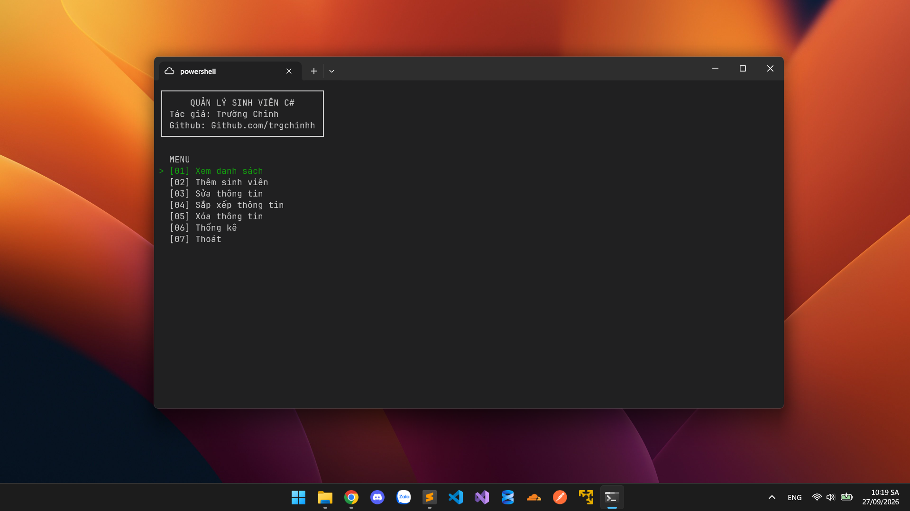

# Chương trình quản lý sinh viên 

Chương trình quản lý sinh viên CLI bằng ngôn ngữ C#, với các chức năng cơ bản như xem danh sách, lọc sinh viên, xóa, sửa thông tin, sắp xếp, thống kê. Mục đích làm quen với cú pháp và lập trình hướng đối tượng bằng ngôn ngữ này.



---

### Biên dịch và khởi chạy
```bash
git clone https://github.com/trgchinhh/quanlysinhvien-csharp.git
cd ./quanlysinhvien-csharp
dotnet run 
```
---

## Tác giả
**Nguyễn Trường Chinh (NTC++)**<br>
**GitHub:** [https://github.com/trgchinhh](https://github.com/trgchinhh)

---

> 📌 Dự án nhỏ được phát triển với mục đích học tập và nghiên cứu. Mọi góp ý và đóng góp đều được hoan nghênh.  